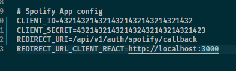

# Spotify React Clone - Context API Version


Spotify React Clone is a using ReactJS library to creating a web single page.

## Features
- Login SSO with Spotify credentials.

## Install
### Node
```
https://nodejs.org/en/
```
You should choose to "Recommended For Most Users" version.

### ReactJS
```
npm install -g create-react-app
```

## Getting started
Use this link to clone this project:
```
https://github.com/lockunlatui/spotify-react-clone-context-api-version.git
```

### Setup to Client
You use to below command:

```
cd spotify-react-clone-context-api-version
```

and

```
npm install
```

After we setup and install all package for client side (FRONT-END).

### Setup to Mongodb

We continue to register the MONGODB with this link (https://www.mongodb.com/)
and click to


if you have account then you click to


After We have a Mongodb account then we log in and it will show as this image


click to "Create an Organization"


enter Name Your Organization field, select to "MongoDB Atlas" and "Next"


and "Create Organization".

Now we create new project as click to


and enter field Name Project 


and Next and Create Project.

We build a Cluster.


and "Create a cluster" start at FREE.


You can choose any cluster that is right. But in this case, I choose Asia (Singapore).

And I click "Create Cluster".

We must wait some minutes until Cluster is creating.

Okey. After Cluster is created. We click to Connect.


(1) Click to "Add Your Current IP Address" to MongoDB know that IP is permitted. 
(2) You fill to "Username" and "Password". This step will support us connecting with Mongodb.

If you completed it show to this image. 


And click "Choose a connection method"

This step, I choose to "Connecting your application".

and copy this command

```
mongodb+srv://dbUser:<password>@cluster0.xgfha.mongodb.net/myFirstDatabase?retryWrites=true&w=majority
```
change <password> to my password of database "dbUser". And open file .env in my source.
change "myFirstDatabase" to database in Collections.


Continued to create Collection with click "Collections" button.


click "Add My Own Data"


and "Create". After copy name collection that I already created.

In this case, I copy "spotifyCloneReact".


and paste to .env file. 


Okey. We created new Mongodb database for my application. If

### Setup to Spotify App Auth.

Access to https://developer.spotify.com/dashboard/. And login


Click "Accept The Term".

Click "Create An App".


And click "Create". We have "Client ID" and "Client Secret" 


We copy both "Client ID" and "Client Secret" and open the .env file to paste into place CLIENT_ID, CLIENT_SECRET.

And final step, We click "Edit Settings". I write callback endpoint is "/api/v1/auth/spotify/callback" in server.ts file and run PORT 3001. But I still need to redirect to PORT 3000 of React. Should I config two URL callbacks


and Save.

Copy "/api/v1/auth/spotify/callback" to .env file and paste to REDIRECT_URI.



So we completed all setup about environment.

Now i use command:

Start React app: 

```
npm start
```

Start Node app:

```
npm run start:api
```

## Screenshot
## Home when page don't have authenticate


## Home when page have authenticate
